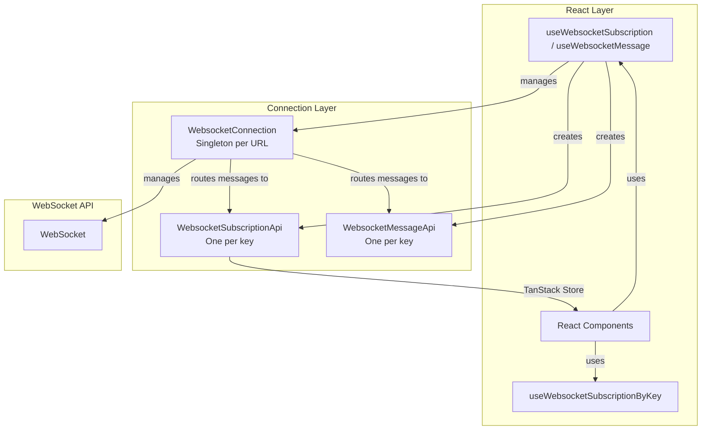
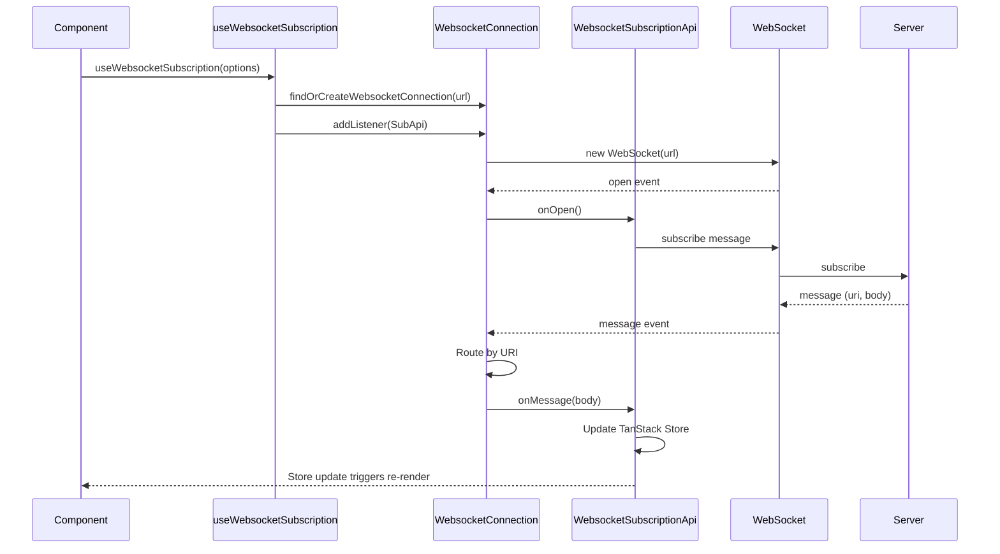
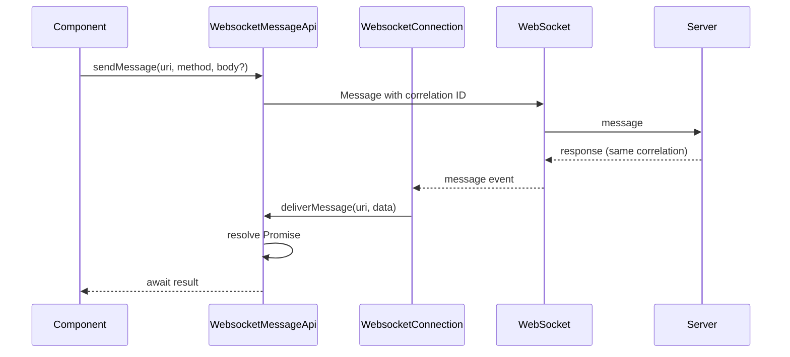

# @maxtroost/use-websocket

A robust WebSocket connection management package for React applications with automatic reconnection, heartbeat monitoring, URI-based message routing, and React integration via TanStack Store.

## Installation

```bash
npm install @maxtroost/use-websocket
```

**Peer dependencies:** React 18+, React DOM 18+. The package uses `notistack` for reconnection notifications — wrap your app in `SnackbarProvider` from `notistack` if you want users to see connection status toasts.

---

## Quick Start

```tsx
import { useWebsocketSubscription } from "@maxtroost/use-websocket";
import { useStore } from "@tanstack/react-store";

function LiveNotifications() {
  const api = useWebsocketSubscription<Notification[]>({
    key: "notifications",
    url: "wss://api.example.com/ws",
    uri: "/notifications",
  });

  const notifications = useStore(api.store, (s) => s.message);
  const loading = useStore(api.store, (s) => s.pendingSubscription);

  if (loading) return <div>Connecting...</div>;
  return (
    <ul>
      {notifications?.map((n) => (
        <li key={n.id}>{n.text}</li>
      ))}
    </ul>
  );
}
```

---

## Examples

### Subscription (Streaming Data)

Subscribe to a URI and receive streaming data via a reactive TanStack Store.

```tsx
import { useWebsocketSubscription } from "@maxtroost/use-websocket";
import { useStore } from "@tanstack/react-store";

interface Voyage {
  id: string;
  name: string;
  status: string;
}

function VoyageList() {
  const voyageApi = useWebsocketSubscription<Voyage[], { status: string }>({
    key: "voyages-list",
    url: "wss://api.example.com/ws",
    uri: "/api/voyages",
    body: { status: "active" },
  });

  const voyages = useStore(voyageApi.store, (s) => s.message);
  const pending = useStore(voyageApi.store, (s) => s.pendingSubscription);
  const connected = useStore(voyageApi.store, (s) => s.connected);

  if (pending) return <Skeleton />;
  return (
    <div>
      {!connected && <span>Reconnecting...</span>}
      {voyages?.map((v) => (
        <div key={v.id}>{v.name}</div>
      ))}
    </div>
  );
}
```

### Access Store by Key (Child Components)

When a parent creates the subscription, children can access the same store by key.

```tsx
import { useWebsocketSubscriptionByKey } from "@maxtroost/use-websocket";
import { useStore } from "@tanstack/react-store";

function VoyageCount() {
  const voyagesStore = useWebsocketSubscriptionByKey<Voyage[]>("voyages-list");
  const voyages = useStore(voyagesStore, (s) => s.message);
  return <div>Total: {voyages?.length ?? 0}</div>;
}
```

### Message API (Request/Response)

For one-off commands (validate, modify, mark read) — send a message and optionally await a response.

```tsx
import { useWebsocketMessage } from "@maxtroost/use-websocket";

function VoyageActions() {
  const api = useWebsocketMessage<ValidationResult, FormValues>({
    key: "voyages/modify",
    url: "wss://api.example.com/ws",
    responseTimeoutMs: 5000,
  });

  const handleValidate = async () => {
    const result = await api.sendMessage(
      "voyages/modify/validate",
      "post",
      formValues
    );
    if (result.valid) {
      // proceed
    }
  };

  const handleMarkRead = () => {
    api.sendMessageNoWait(`notifications/${id}/read`, "post");
  };

  return (
    <>
      <button onClick={handleValidate}>Validate</button>
      <button onClick={handleMarkRead}>Mark Read</button>
    </>
  );
}
```

### Conditional Subscription (enabled)

Disable the subscription when the user is not authenticated or when a feature flag is off.

```tsx
function VoyageList({ isAuthenticated }: { isAuthenticated: boolean }) {
  const api = useWebsocketSubscription<Voyage[]>({
    key: "voyages-list",
    url: "wss://api.example.com/ws",
    uri: "/api/voyages",
    enabled: isAuthenticated,
  });
  // ...
}
```

### Lifecycle Callbacks

```tsx
const api = useWebsocketSubscription<Voyage[]>({
  key: "voyages",
  url: "wss://api.example.com/ws",
  uri: "/api/voyages",
  onSubscribe: ({ uri }) => console.log("Subscribed to", uri),
  onMessage: ({ data }) => console.log("Received", data),
  onError: (error) => {
    if (error.type === "transport") console.error("Connection error", error.event);
  },
  onMessageError: (error) => {
    if (error.type === "server") console.error("Server error", error.message);
  },
  onClose: (event) => console.log("Connection closed", event.code),
});
```

---

## Component Hierarchy



---

## Data Flow & Architecture

### Choosing the Right Hook

| Hook                            | Use Case                                                          |
| ------------------------------- | ----------------------------------------------------------------- |
| `useWebsocketSubscription`      | Streaming data (voyage list, notifications, live updates)         |
| `useWebsocketMessage`           | One-off commands (validate, modify, mark read) — request/response |
| `useWebsocketSubscriptionByKey` | Child component needs parent's subscription data                  |

### Message Flow: Subscription



### Message Flow: Request/Response (useWebsocketMessage)



---

## Key Behaviors

### Subscription Behavior

Subscriptions automatically subscribe when the WebSocket connection opens.

### Store Shape (WebsocketSubscriptionStore)

```typescript
interface WebsocketSubscriptionStore<TData> {
  message: TData | undefined;       // Latest data from server
  subscribed: boolean;             // Subscription confirmed
  pendingSubscription: boolean;   // Subscribe sent, waiting for first response (for loading UI)
  subscribedAt: number | undefined;
  receivedAt: number | undefined;
  connected: boolean;             // WebSocket open
  messageError: WebsocketTransportError | undefined;
  serverError: WebsocketServerError<unknown> | undefined;
}
```

### Reconnection Backoff

| Attempt Range | Wait Time  |
| ------------- | ---------- |
| 0–4 attempts  | 4 seconds  |
| 5–9 attempts  | 30 seconds |
| 10+ attempts  | 90 seconds |

User notifications are shown after 10 failed attempts. Reconnection stops after 20 attempts (~18 minutes); users can retry manually via the notification action.

---

## Options Reference

### WebsocketSubscriptionOptions

| Option | Type | Required | Default | Description |
| ------ | ---- | -------- | ------- | ----------- |
| `key` | `string` | Yes | — | Unique identifier. Components with the same key share the API. Used by `useWebsocketSubscriptionByKey` to access the store. |
| `url` | `string` | Yes | — | Base WebSocket URL (e.g. `wss://api.example.com/ws`). One connection per URL. |
| `uri` | `string` | Yes | — | URI endpoint for this subscription. Incoming messages are routed by URI. |
| `body` | `TBody` | No | — | Optional payload sent with the subscription. |
| `enabled` | `boolean` | No | `true` | When `false`, disconnects the listener and removes it from the connection. |
| `method` | `string` | No | — | Optional HTTP-like method for custom messages sent via `sendMessage`. |
| `onSubscribe` | `(props: { uri: string; body?: TBody; uriApi }) => void` | No | — | Called when the subscription is successful. |
| `onMessage` | `(props: { data: TData; uriApi }) => void` | No | — | Called when a message is received for this URI. |
| `onError` | `(error: WebsocketTransportError) => void` | No | — | Called on WebSocket transport errors (connection failure, network issues). |
| `onMessageError` | `(error: WebsocketServerError<TBody>) => void` | No | — | Called when the server sends an error message (method `error`, `conflict`, or `exception`). |
| `onClose` | `(event: CloseEvent) => void` | No | — | Called when the WebSocket connection closes. |

### WebsocketMessageOptions

| Option | Type | Required | Default | Description |
| ------ | ---- | -------- | ------- | ----------- |
| `key` | `string` | Yes | — | Unique identifier. Components with the same key share the Message API. |
| `url` | `string` | Yes | — | Base WebSocket URL. |
| `enabled` | `boolean` | No | `true` | When `false`, disconnects. `sendMessage` rejects; `sendMessageNoWait` is a no-op. |
| `responseTimeoutMs` | `number` | No | `10000` | Default timeout (ms) for `sendMessage`. Can be overridden per call via `sendMessage(uri, method, body?, { timeout })`. |
| `onError` | `(error: WebsocketTransportError) => void` | No | — | Called on transport errors. |
| `onMessageError` | `(error: WebsocketServerError) => void` | No | — | Called on server error messages. |
| `onClose` | `(event: CloseEvent) => void` | No | — | Called when the connection closes. |

### sendMessage Options

| Option | Type | Description |
| ------ | ---- | ----------- |
| `timeout` | `number` | Override the default response timeout for this call (ms). |

```typescript
await api.sendMessage("/api/command", "post", body, { timeout: 3000 });
```

---

## Troubleshooting & Debugging

### Common Issues

#### Subscription Never Receives Data

- **Symptoms**: `message` stays `undefined`, `pendingSubscription` remains `true`
- **Possible causes**: Wrong `uri`, server not sending to that URI, connection not open
- **Debugging**: Check `connected` in store; verify server logs for incoming subscribe; ensure the WebSocket URL is correct
- **Solution**: Confirm `uri` matches server route; check network tab for WebSocket frames

#### Connection Drops Repeatedly

- **Symptoms**: Frequent reconnects, notifications after 10 attempts
- **Possible causes**: Auth token expiry, CORS, wrong URL, server rejecting connection
- **Debugging**: Use `WebsocketConnection.setCustomLogger` to log events
- **Solution**: Verify the WebSocket URL and auth; check server logs for rejection reasons

#### Child Component Gets Empty Store

- **Symptoms**: `useWebsocketSubscriptionByKey` returns fallback store with `message: undefined`
- **Possible causes**: Parent with `useWebsocketSubscription` not mounted yet; different `key` used
- **Debugging**: Ensure parent mounts first; verify `key` string matches exactly
- **Solution**: Use same `key` in parent and child; consider lifting subscription higher in tree

### Debugging Tools

- **Browser DevTools**: Network tab → WS filter for WebSocket frames
- **Custom logger**: `WebsocketConnection.setCustomLogger({ log: (level, event, data) => console.log(level, event, data) })`
- **Store inspection**: `useStore(api.store)` to read full state

### Error Types

- **WebsocketTransportError**: Connection failure, network issues (`error.type === 'transport'`, raw `Event` in `error.event`)
- **WebsocketServerError**: Server-sent error message (`error.type === 'server'`, parsed body in `error.message`)

---

## Dependencies

| Dependency              | Purpose                                  |
| ----------------------- | ---------------------------------------- |
| `@tanstack/react-store` | Reactive state for components            |
| `@tanstack/store`       | Core store implementation                |
| `notistack`             | User notifications (reconnection errors) |
| `uuid`                  | Correlation IDs                          |
| `fast-equals`           | Deep equality for options                |
| `usehooks-ts`           | `useIsomorphicLayoutEffect`              |

---

## API

| Export | Description |
| ------ | ----------- |
| `useWebsocketSubscription` | Subscribe to a URI and receive streaming data via a reactive store |
| `useWebsocketSubscriptionByKey` | Access the store of a subscription created elsewhere (by key) |
| `useWebsocketMessage` | Send request/response messages to any URI |
| `WebsocketConnection` | Low-level connection class; `setCustomLogger` for debugging |
| `websocketConnectionsReconnect` | Trigger reconnection on all connections (e.g. when auth URL changes) |
| `ReadyState`, `WebsocketSubscriptionStore`, `WebsocketTransportError`, `WebsocketServerError` | Types |

---

## Learn More

For contributors and deeper architecture details:

- **[WEBSOCKET_CONNECTION.md](src/lib/WEBSOCKET_CONNECTION.md)** — Connection lifecycle, class diagrams, URI API lifecycle, browser online/offline handling, full API reference
- **[CHART.md](CHART.md)** — Mermaid flow diagrams for hooks, connection, and error flows
