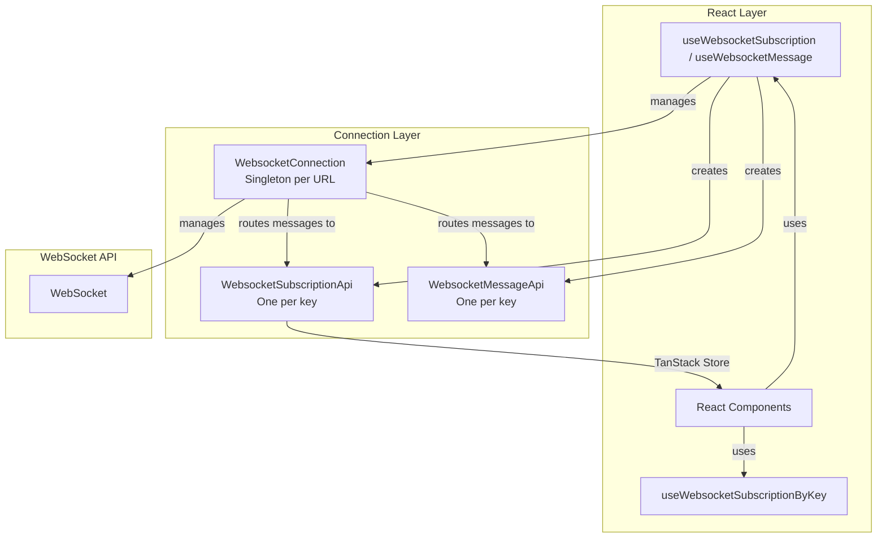
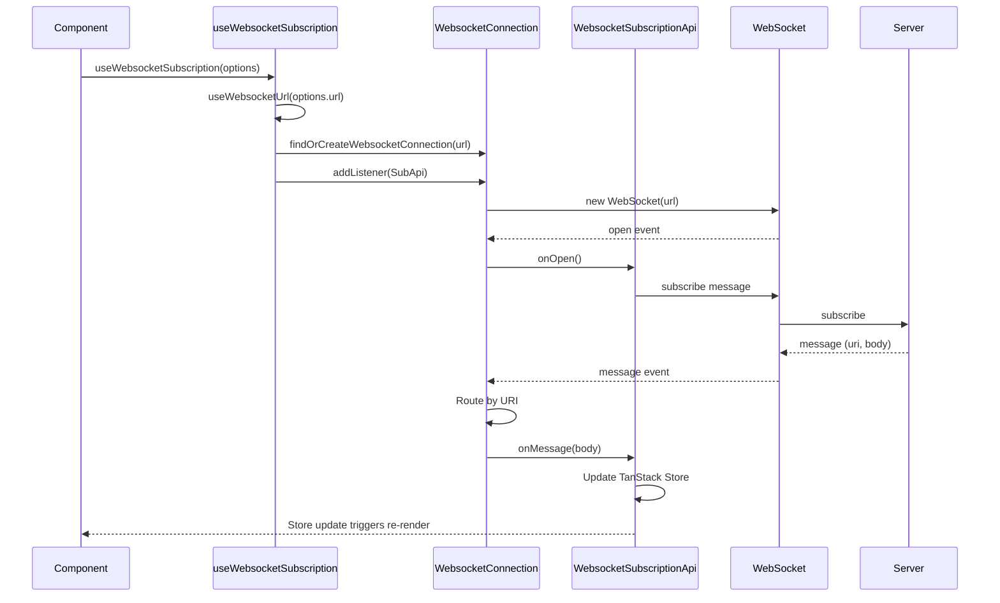
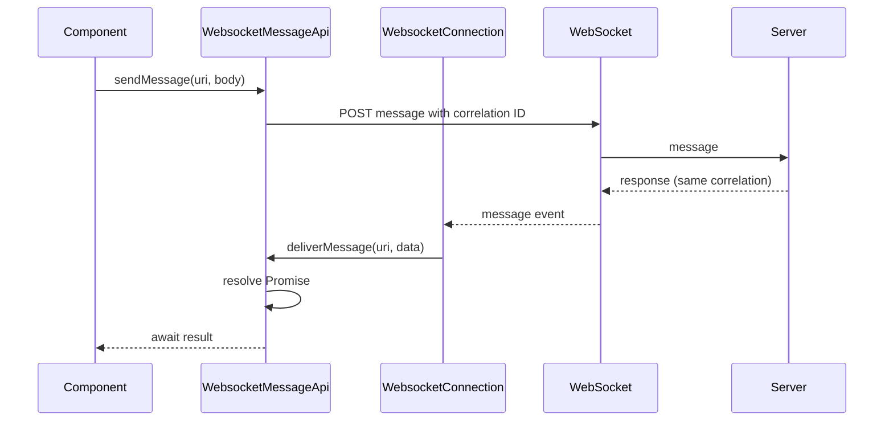

# @mono-fleet/use-websocket

A robust WebSocket connection management package for React applications with automatic reconnection, heartbeat monitoring, URI-based message routing, and React integration via TanStack Store.

## 📚 Navigation

### External Links

- **[Mono-Fleet Root](../../README.md)** — Return to workspace overview
- **[Penny Application](../../apps/penny/README.MD)** — Penny application (primary consumer)
- **[GIDS Application](../../apps/gids/README.md)** — GIDS application

### Internal Sections

- [Features & Purpose](#-features--purpose)
- [Code Structure](#-code-structure)
- [Data Flow & Architecture](#-data-flow--architecture)
- [Key Behaviors](#-key-behaviors)
- [Usage & Integration](#-usage--integration)
- [Testing Strategy](#-testing-strategy)
- [Troubleshooting & Debugging](#-troubleshooting--debugging)
- [Dependencies](#-dependencies)

---

## 🎯 Features & Purpose

This package provides a comprehensive WebSocket solution for React applications that require real-time data streaming and request/response messaging over a single connection.

### Problems Solved

- **Duplicate connections**: Prevents multiple WebSocket connections to the same URL
- **Stale connections**: Detects and recovers from silent connection failures via heartbeat
- **Reconnection complexity**: Handles reconnection with exponential backoff and browser online/offline detection
- **Subscription sharing**: Multiple components can share the same subscription via a unique key
- **Auth-aware URLs**: WebSocket URLs are built from the current auth context (region, role, user)

### Key Features

| Feature | Description |
|--------|-------------|
| **Singleton Connection** | One connection per URL shared across all hooks |
| **Key-Based API Management** | Subscription and Message APIs identified by unique keys; components with the same key share the instance |
| **Automatic Reconnection** | Three-phase exponential backoff (4s → 30s → 90s) |
| **Heartbeat Monitoring** | Ping/pong every 40 seconds to detect stale connections |
| **URI-Based Routing** | Multiple subscriptions over a single connection |
| **React Integration** | TanStack Store for reactive data updates |
| **Online/Offline Detection** | Browser connectivity change handling |
| **Two API Types** | **Subscription** for streaming data; **Message** for request/response commands |

### Target Users

- **Developers** integrating real-time data (voyages, rotations, notifications) into React apps
- **Applications** using `@mono-fleet/iam-provider` for region-based authentication

---

## 🏗️ Code Structure

```
packages/use-websocket/
├── src/
│   ├── index.ts                    # Public exports
│   └── lib/
│       ├── WebsocketHook.ts        # React hooks (useWebsocketSubscription, useWebsocketMessage, useWebsocketSubscriptionByKey)
│       ├── WebsocketProvider.tsx   # Provider for auth-aware reconnection
│       ├── WebsocketConnection.ts  # Connection lifecycle, reconnection, heartbeat
│       ├── WebsocketSubscriptionApi.ts  # Streaming subscription per URI
│       ├── WebsocketMessageApi.ts  # Request/response messaging (no subscription)
│       ├── websocketStores.ts      # Global TanStack stores (connections, listeners)
│       ├── websocketStores.helpers.ts  # findOrCreateWebsocketConnection, createWebsocketUriApi, etc.
│       ├── types.ts                # Types, options, store shapes
│       ├── utils.ts                # createWebsocketUrl
│       ├── constants.ts            # Timing, close codes, defaults
│       ├── WebsocketConnection.helpers.ts  # Reconnection, ping, notifications
│       └── WEBSOCKET_CONNECTION.md # Detailed architecture and flows
├── README.md
├── FLOWS.md                        # Mermaid flow diagrams
└── package.json
```

### Component Hierarchy



---

## 🔄 Data Flow & Architecture

### Choosing the Right Hook

| Hook | Use Case |
|------|----------|
| `useWebsocketSubscription` | Streaming data (voyage list, notifications, live updates) |
| `useWebsocketMessage` | One-off commands (validate, modify, mark read) — request/response |
| `useWebsocketSubscriptionByKey` | Child component needs parent's subscription data |

### Message Flow: Subscription



### Message Flow: Request/Response (useWebsocketMessage)



---

## ⚙️ Key Behaviors

### Subscription Behavior

Subscriptions automatically subscribe when the WebSocket connection opens.

### Store Shape (WebsocketSubscriptionStore)

```typescript
interface WebsocketSubscriptionStore<TData> {
  message: TData | undefined;       // Latest data from server
  subscribed: boolean;              // Subscription confirmed
  pendingSubscription: boolean;     // Subscribe sent, waiting for first response (for loading UI)
  subscribedAt: number | undefined;
  receivedAt: number | undefined;
  connected: boolean;               // WebSocket open
  messageError: WebsocketTransportError | undefined;
  serverError: WebsocketServerError<unknown> | undefined;
}
```

### Reconnection Backoff

| Attempt Range | Wait Time |
|---------------|-----------|
| 0–4 attempts | 4 seconds |
| 5–9 attempts | 30 seconds |
| 10+ attempts | 90 seconds |

### Provider Requirements

- **WebsocketProvider** must wrap the app and be placed inside `@mono-fleet/iam-provider`
- Reconnects all connections when `selectedRegionRole` changes
- Sets custom logger for Datadog RUM and token refresh on repeated failures

---

## 🔧 Usage & Integration

### Setup

```tsx
import { WebsocketProvider } from '@mono-fleet/use-websocket';
import { AuthProvider } from '@mono-fleet/iam-provider';

function App() {
  return (
    <AuthProvider>
      <WebsocketProvider>
        <YourApp />
      </WebsocketProvider>
    </AuthProvider>
  );
}
```

### Subscription (Streaming Data)

```typescript
import { useWebsocketSubscription } from '@mono-fleet/use-websocket';
import { useStore } from '@tanstack/react-store';

function VoyageList() {
  const voyageApi = useWebsocketSubscription<Voyage[], VoyageFilters>({
    key: 'voyages-list',
    url: '/api',
    uri: '/api/voyages',
    body: { status: 'active' }
  });

  const voyages = useStore(voyageApi.store, (s) => s.message);
  const pending = useStore(voyageApi.store, (s) => s.pendingSubscription);

  if (pending) return <Skeleton />;
  return <div>{/* Render voyages */}</div>;
}
```

### Access Store by Key (Child Components)

```typescript
import { useWebsocketSubscriptionByKey } from '@mono-fleet/use-websocket';
import { useStore } from '@tanstack/react-store';

function VoyageCount() {
  const voyagesStore = useWebsocketSubscriptionByKey<Voyage[]>('voyages-list');
  const voyages = useStore(voyagesStore, (s) => s.message);
  return <div>Total: {voyages?.length ?? 0}</div>;
}
```

### Message API (Request/Response)

```typescript
import { useWebsocketMessage } from '@mono-fleet/use-websocket';

function VoyageActions() {
  const api = useWebsocketMessage<ModifyVoyageUim, ModifyVoyageUim>({
    key: 'voyages/modify',
    url: '/api',
    responseTimeoutMs: 5000
  });

  const handleValidate = async () => {
    const result = await api.sendMessage('voyages/modify/validate', 'post', formValues);
    // ...
  };

  const handleMarkRead = () => {
    api.sendMessageNoWait(`notifications/${id}/read`, 'post');
  };
}
```

### Options Reference

#### WebsocketSubscriptionOptions

| Option | Type | Description |
|--------|------|-------------|
| `key` | `string` | Unique identifier; components with same key share the API |
| `url` | `string` | Base WebSocket path (combined with region from auth) |
| `uri` | `string` | URI endpoint for this subscription |
| `body` | `TBody` | Optional payload for subscription |
| `enabled` | `boolean` | When `false`, disconnects (default: `true`) |
| `secretToken` | `string` | Optional auth token (e.g. for local dev) |
| `onMessage`, `onSubscribe`, `onError`, `onClose` | callbacks | Lifecycle callbacks |

#### WebsocketMessageOptions

| Option | Type | Description |
|--------|------|-------------|
| `key` | `string` | Unique identifier |
| `url` | `string` | Base WebSocket path |
| `enabled` | `boolean` | When `false`, disconnects |
| `responseTimeoutMs` | `number` | Default timeout for `sendMessage` (default: 10000) |
| `secretToken` | `string` | Optional auth token |

---

## 🧪 Testing Strategy

### Test Files

| File | Coverage |
|------|----------|
| `createWebsocketUrl.test.ts` | URL construction for dev/prod, auth params |
| `WebsocketConnection.helpers.test.ts` | Reconnection backoff, ping, validation helpers |
| `WebsocketSubscriptionApi.test.ts` | Subscription lifecycle, store updates |
| `WebsocketMessageApi.test.ts` | Request/response, timeout, overwrite behavior |

### Running Tests

```bash
nx test use-websocket
```

### What to Test When Adding Features

- Helper functions: URL building, backoff calculation, message validation
- Edge cases: empty body, undefined params, timeout scenarios
- Store updates: verify `message`, `pendingSubscription`, `subscribed` transitions

---

## 🐛 Troubleshooting & Debugging

### Common Issues

#### Subscription Never Receives Data

- **Symptoms**: `message` stays `undefined`, `pendingSubscription` remains `true`
- **Possible causes**: Wrong `uri`, server not sending to that URI, connection not open
- **Debugging**: Check `connected` in store; verify server logs for incoming subscribe; ensure `WebsocketProvider` is mounted inside auth provider
- **Solution**: Confirm `uri` matches server route; check network tab for WebSocket frames

#### Connection Drops Repeatedly

- **Symptoms**: Frequent reconnects, notifications after 10 attempts
- **Possible causes**: Auth token expiry, CORS, wrong URL, server rejecting connection
- **Debugging**: `WebsocketConnection.setCustomLogger` to log events; check `connectionFailed` callback (token refresh triggered after 5 retries)
- **Solution**: Ensure `secretToken` for cross-origin; verify auth context provides valid region/role

#### Child Component Gets Empty Store

- **Symptoms**: `useWebsocketSubscriptionByKey` returns fallback store with `message: undefined`
- **Possible causes**: Parent with `useWebsocketSubscription` not mounted yet; different `key` used
- **Debugging**: Ensure parent mounts first; verify `key` string matches exactly
- **Solution**: Use same `key` in parent and child; consider lifting subscription higher in tree

### Debugging Tools

- **Browser DevTools**: Network tab → WS filter for WebSocket frames
- **Datadog RUM**: Events `ws-connect`, `ws-close`, `ws-error`, `ws-reconnect`
- **Store inspection**: `useStore(api.store)` to read full state

### Error Types

- **WebsocketTransportError**: Connection failure, network issues (`error.type === 'transport'`)
- **WebsocketServerError**: Server-sent error message (`error.type === 'server'`, body in `error.message`)

---

## 📦 Dependencies

| Dependency | Purpose |
|------------|---------|
| `@tanstack/react-store` | Reactive state for components |
| `@tanstack/store` | Core store implementation |
| `@mono-fleet/iam-provider` | Auth context for URL generation |
| `@mono-fleet/common-utils` | `wait` for reconnection delays |
| `@datadog/browser-rum` | Monitoring and logging |
| `notistack` | User notifications |
| `uuid` | Correlation IDs |
| `fast-equals` | Deep equality for options |
| `usehooks-ts` | `useIsomorphicLayoutEffect` |

---

## Learn More

See [WEBSOCKET_CONNECTION.md](src/lib/WEBSOCKET_CONNECTION.md) for:

- Detailed architecture and class diagrams
- Connection lifecycle and reconnection flows
- URI API lifecycle and options update flow
- Browser online/offline handling
- Full API reference
